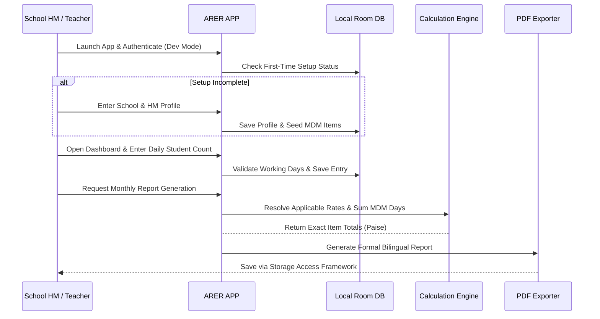
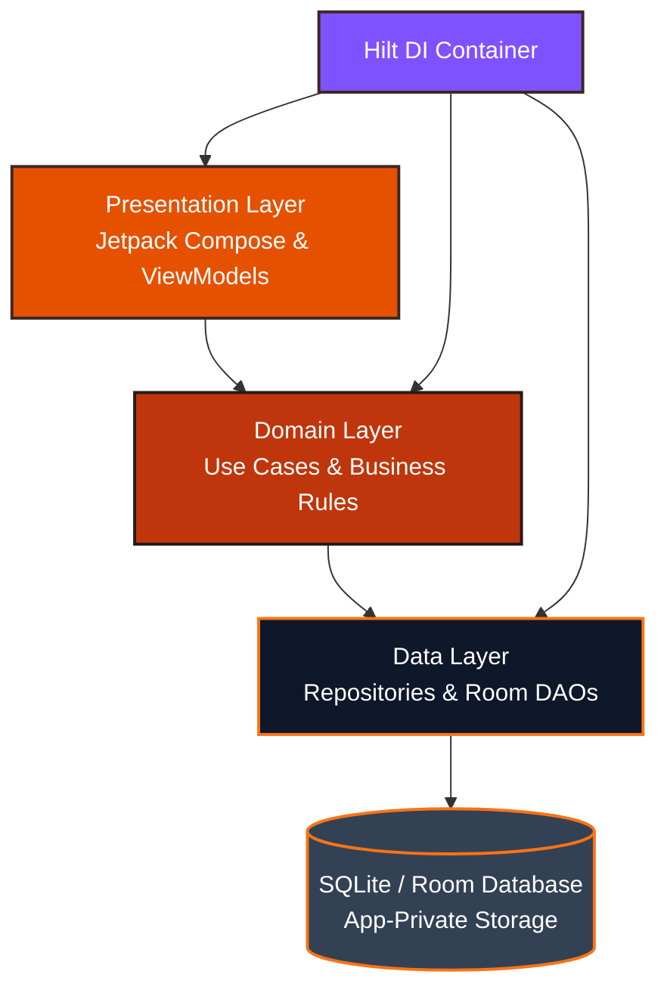
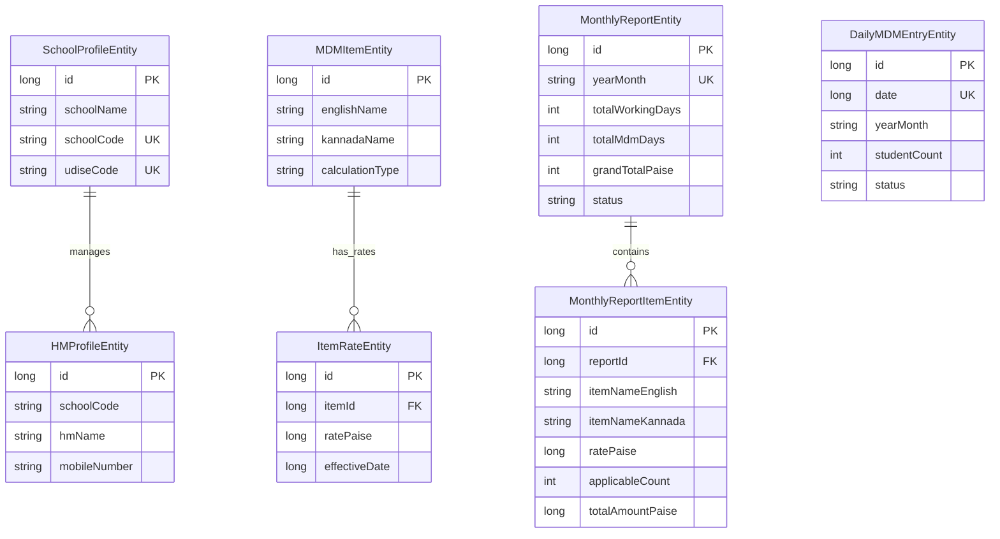

<div align="center">

# 🍊 ARER APP

### **School MDM & Report Assistant**
*Professional offline-first Android application designed to simplify monthly Mid-Day Meal (MDM) and contingency report preparation for government and general schools.*

<p align="center">
  
</p>

<p align="center">
  
  
  
  
  
  
  
</p>

</div>

<hr>

## 🟠 Current Development Status

| Phase | Module / Milestone | Status |
| :--- | :--- | :--- |
| **Phase 1** | Foundation, Room Database & Entities, DAOs, Hilt, Theme | ✅ **Completed** |
| **Phase 2** | First-Time Setup, School/HM Profile, MDM Item Seeding, Auth Flow | ✅ **Completed** |
| **Phase 3** | Daily MDM Entry & Working-Day / Holiday Override Engine | ⏳ **Planned** |
| **Phase 4** | Item Rate System & Monthly Rate Confirmation | ⏳ **Planned** |
| **Phase 5** | Deterministic Calculation Engine & Financial Accuracy (Paise) | ⏳ **Planned** |
| **Phase 6** | Formal PDF & CSV Report Generation (Kannada Unicode Support) | ⏳ **Planned** |
| **Phase 7** | Report History, Dashboard Analytics, Polish & Verification | ⏳ **Planned** |
| **V2** | Cloud Sync, Multi-Device Backup & Stock Management | 🔮 **Future Vision** |

<hr>

## 📑 Quick Navigation

- [Overview](#-overview)
- [The Problem vs. Solution](#-the-problem-vs--solution)
- [The ARER Difference](#-the-arer-difference)
- [Feature Showcase](#-feature-showcase)
- [System Workflow](#-animated-system-workflow)
- [Architecture & Clean Design](#-architecture)
- [Database ER Schema](#-database-architecture)
- [Financial Accuracy (Paise System)](#-financial-accuracy)
- [Offline-First Architecture](#-offline-first-architecture)
- [Security Model](#-security)
- [Tech Stack](#-tech-stack)
- [Project Structure](#-project-structure)
- [Getting Started & Build](#-getting-started)
- [Testing](#-testing)
- [Contributing](#-contributing)

<hr>

## 📖 Overview

School Head Masters (HMs) and Assistant Teachers traditionally maintain daily student attendance in registers or Excel spreadsheets, followed by manual monthly calculations of item-wise expenditures for Mid-Day Meal (MDM) bills. This manual workflow is prone to calculation errors, rate mismatches, and tedious paperwork.

**ARER APP** digitizes and streamlines this exact workflow into a lightning-fast, offline-first Android application designed specifically for Indian government and general schools.

---

## 🛑 The Problem vs. 🚀 Solution

```mermaid
graph LR
    subg1 [Traditional Manual Process]
        A1[Paper Register] --> B1[Daily Counting] --> C1[Manual Arithmetic] --> D1[Excel / Bill Sheets] --> E1[High Error Risk]
    end
    subg2 [ARER APP Workflow]
        A2[Daily Student Entry] --> B2[Automatic Holiday Validation] --> C2[Rate Resolution] --> D2[Exact Paise Calculation] --> E2[Formal PDF Report]
    end
    style g1 fill:#FFF8F6,stroke:#BF360C,stroke-width:2px
    style g2 fill:#FFF8F6,stroke:#E65100,stroke-width:2px
```

---

## 💎 The ARER Difference

| Principle | Description |
| :--- | :--- |
| **⚡ Simple** | Large touch targets and minimal screens tailored for users with basic smartphone familiarity. |
| **🔒 Private** | 100% offline-first; sensitive school and HM data stays securely in device-internal storage. |
| **📶 Offline First** | Zero internet dependency required during monthly operations or report generation. |
| **🧮 Accurate** | Strict integer minor-currency unit calculations (paise) prevent floating-point rounding bugs. |
| **📊 Transparent** | Historical rate snapshots ensure past bills remain immutable when future item rates change. |
| **🧱 Modular** | Clean Architecture boundaries allow seamless V2 cloud synchronization integration. |
| **🌐 Bilingual** | Native support for Kannada (item names, labels) alongside English and numerical data. |

<hr>

## 🌟 Feature Showcase

### 🏫 School Profile
- Captures School Name, School Code, UDISE Code, KGID Number, District, Taluk, Cluster, Village/Town, Address, and PIN Code.
- Editable anytime through Settings with built-in validation.

### 👨‍🏫 HM Profile
- Head Master / Headmistress identification including HM Name, Designation, HM KGID Number, and Mobile Number.

### 📅 Daily MDM Entry
- Fast daily student head-count entry without requiring complex individual student registers in V1.

### 🗓 Working Days & Holidays
- Automatic detection of Sundays and government holidays.
- Controlled override mechanism with mandatory confirmation and reason logging for special working days.

### 💰 Rate Management & History
- Item Master supporting 11 standard ARER MDM items (`Vegetables`, `Sambar Items`, `Salt`, `Sugar`, `Dal`, `Oil`, `Gas`, `Egg`, `Milk`, `Girini`, `Banana`).
- Historical rate tracking ensuring past reports reference historical applicable rates.

### 🧮 Calculation Engine
- Supports multiple calculation formulas (`PER_STUDENT`, `CUSTOM_COUNT`, `FIXED_MONTHLY`) computed in minor currency units (paise).

### 📄 Report Generation & History
- Formal government-report layout with item-wise breakdown tables, grand totals, and HM signature blocks.
- Primary export in PDF (with Kannada Unicode font support) and CSV, backed by local historical report archives.

<hr>

## 🔄 Animated System Workflow



<hr>

## 🏛 Architecture

ARER APP follows strict **Clean Architecture** and **MVVM** principles:



<hr>

## 🗄 Database Architecture

The Room database foundation comprises 10 core entities designed with proper foreign keys, unique indices, and future multi-school readiness:



<hr>

## 🧮 Financial Accuracy (Paise System)

To prevent floating-point rounding errors common in monetary arithmetic, ARER APP mandates that **all financial values are stored and calculated in integer minor currency units (paise)**:

$$\text{₹1.00} = 100 \text{ paise}$$

- Vegetables Rate: **₹1.80** $\rightarrow$ `180` paise
- Sambar Rate: **₹0.55** $\rightarrow$ `55` paise
- Total for 836 Students: $836 \times 180 = 150,480 \text{ paise} \rightarrow \mathbf{₹1,504.80}$

---

## 🔒 Security Model

- **App-Private Storage**: SQLite/Room databases are stored in internal application storage, inaccessible to unrooted external apps.
- **No Plaintext Secrets**: Authentication is abstracted via `AuthRepository`, with sensitive development tokens handled in isolation.
- **Minimal Permissions**: No broad external storage or unnecessary device permissions requested in V1.

---

## 🛠 Tech Stack

- **Language**: Kotlin 2.0.21
- **UI**: Jetpack Compose, Material 3 (Orange theme)
- **Architecture**: Clean Architecture + MVVM
- **Persistence**: Room 2.8.5, SQLite, DataStore Preferences 1.1.1
- **Dependency Injection**: Hilt 2.60.1
- **Concurrency**: Kotlin Coroutines, Flow / StateFlow
- **Navigation**: Navigation Compose 2.8.5
- **Testing**: JUnit 4, AndroidX Test, Room Testing, Compose UI Testing

---

## 📂 Project Structure

```text
com.arer.app/
├── data/
│   ├── local/
│   │   ├── ArerDatabase.kt
│   │   ├── converter/
│   │   ├── dao/
│   │   └── entity/
│   └── preferences/
├── domain/
│   ├── model/
│   └── repository/
├── data/repository/
├── di/
└── ui/
    ├── auth/
    ├── dashboard/
    ├── entry/
    ├── history/
    ├── main/
    ├── navigation/
    ├── reports/
    ├── settings/
    ├── setup/
    ├── splash/
    └── theme/
```

<hr>

## 🚀 Getting Started

### Prerequisites
- **Android Studio** (Koala or newer recommended)
- **JDK 17**
- **Android SDK** (Compile SDK 37, Min SDK 26)

### Build & Run
Clone the repository and run the Gradle wrapper tasks:

```bash
# Clone repository
git clone https://github.com/YOUR_GITHUB_USERNAME/ARER-APP.git
cd ARER-APP

# Build debug APK
./gradlew assembleDebug

# Run unit tests
./gradlew test
```

<hr>

## 🤝 Contributing

1. Fork the repository (`https://github.com/YOUR_GITHUB_USERNAME/ARER-APP/fork`)
2. Create your feature branch (`git checkout -b feature/AmazingFeature`)
3. Commit your changes (`git commit -m 'feat: Add amazing feature'`)
4. Push to the branch (`git push origin feature/AmazingFeature`)
5. Open a Pull Request

---

## 📜 License

License: **Not yet specified.**
