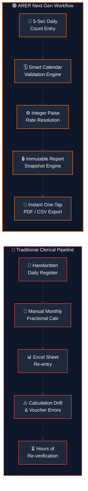
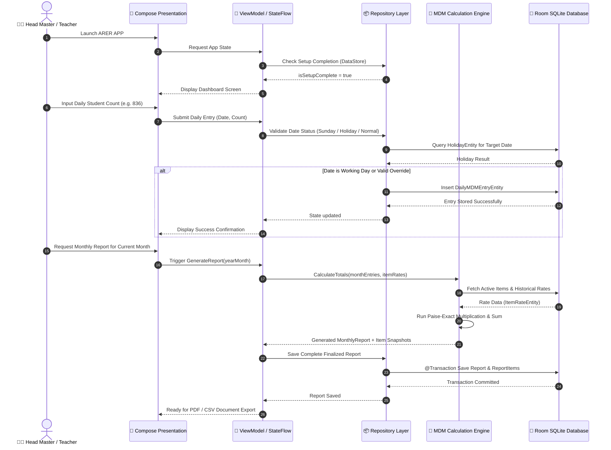
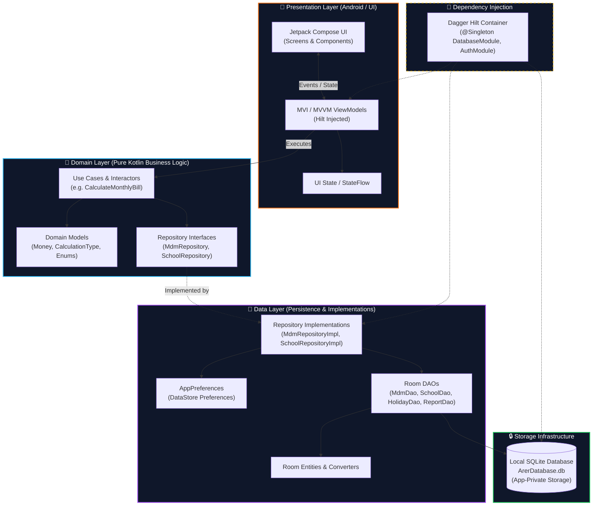
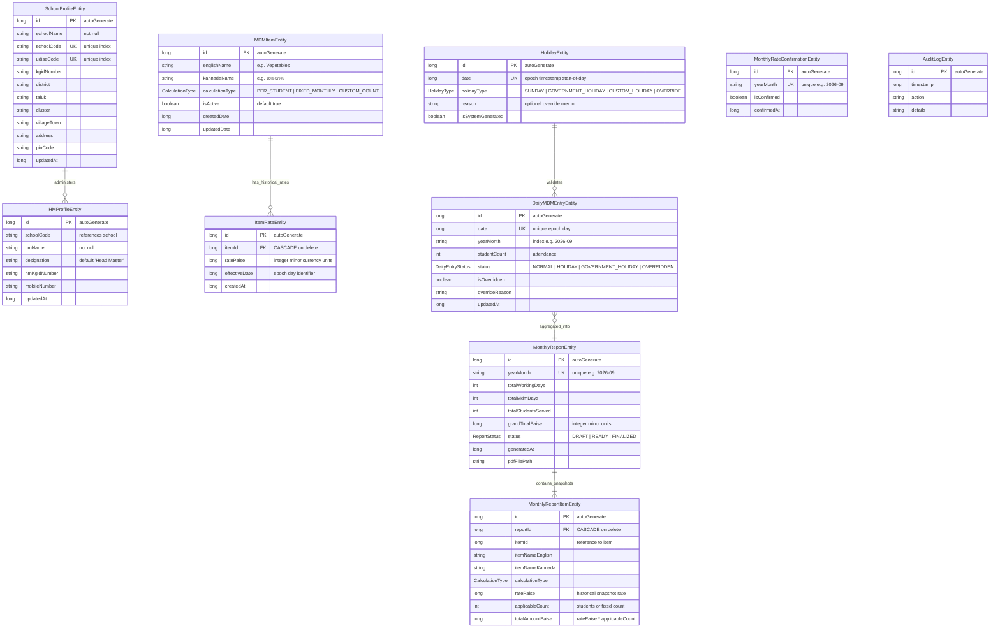
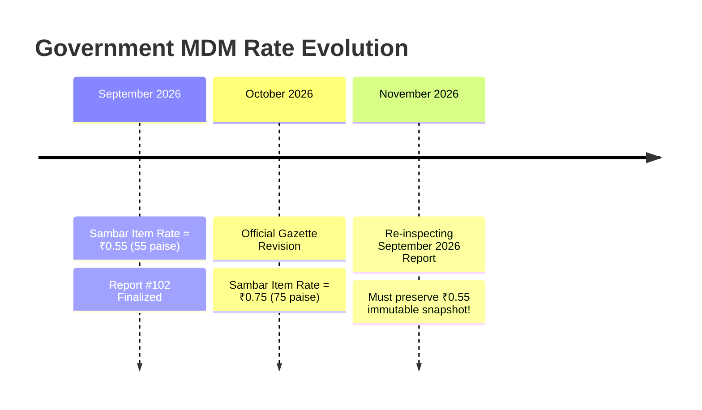
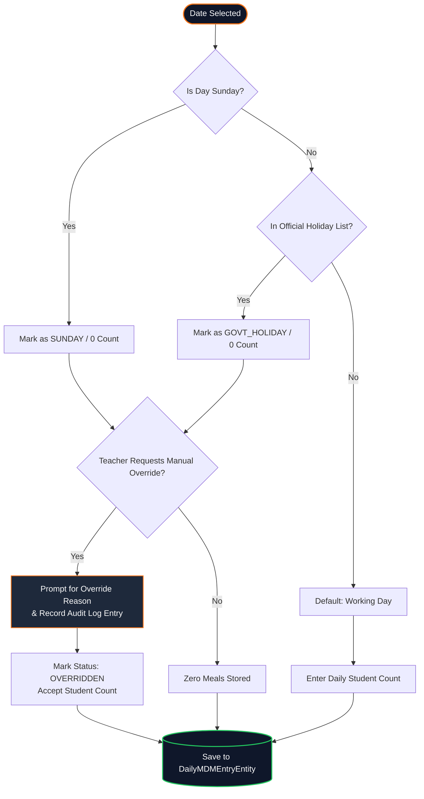
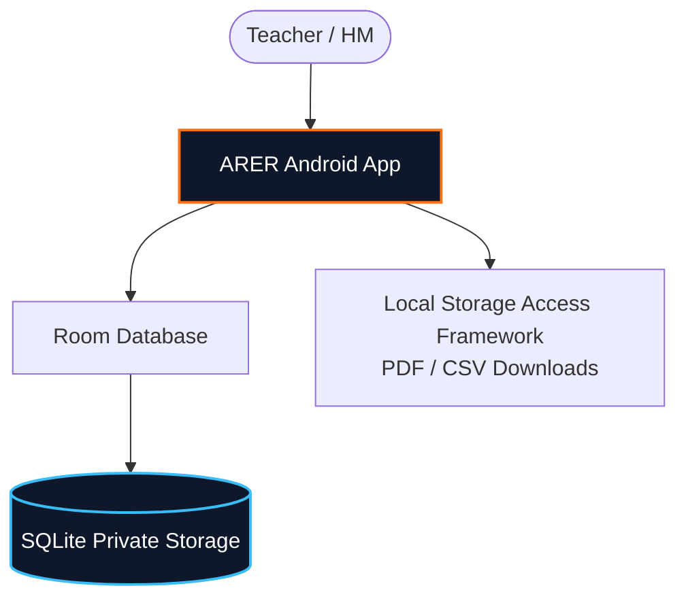
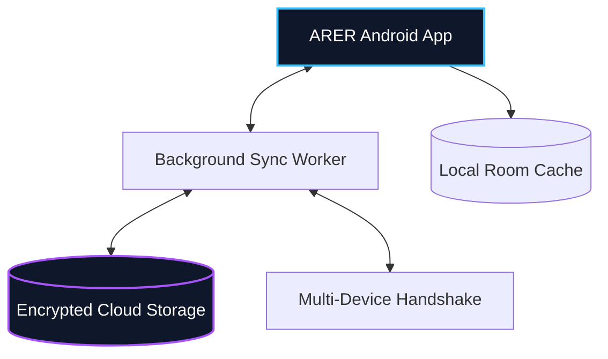
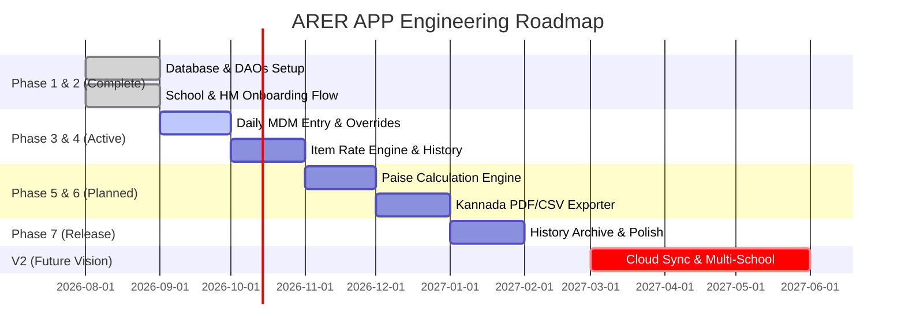

<div align="center">

<!-- 3D HERO HEADER SVG -->
<svg viewBox="0 0 900 220" width="100%" height="220" xmlns="http://www.w3.org/2000/svg">
  <defs>
    <linearGradient id="bgGrad" x1="0%" y1="0%" x2="100%" y2="100%">
      <stop offset="0%" stop-color="#0F172A" />
      <stop offset="45%" stop-color="#1E293B" />
      <stop offset="100%" stop-color="#0F172A" />
    </linearGradient>
    <linearGradient id="orangeGlow" x1="0%" y1="0%" x2="100%" y2="0%">
      <stop offset="0%" stop-color="#EA580C" />
      <stop offset="50%" stop-color="#F97316" />
      <stop offset="100%" stop-color="#FDBA74" />
    </linearGradient>
    <linearGradient id="neonBar" x1="0%" y1="0%" x2="100%" y2="0%">
      <stop offset="0%" stop-color="#F97316" stop-opacity="0" />
      <stop offset="50%" stop-color="#F97316" stop-opacity="1" />
      <stop offset="100%" stop-color="#F97316" stop-opacity="0" />
    </linearGradient>
    <filter id="glow3d" x="-20%" y="-20%" width="140%" height="140%">
      <feGaussianBlur stdDeviation="8" result="blur" />
      <feComposite in="SourceGraphic" in2="blur" operator="over" />
    </filter>
    <filter id="shadow3d">
      <feDropShadow dx="0" dy="8" stdDeviation="6" flood-color="#000000" flood-opacity="0.6"/>
    </filter>
  </defs>

  <!-- Card Background with 3D Bevel -->
  <rect x="8" y="8" width="884" height="204" rx="20" fill="url(#bgGrad)" stroke="#334155" stroke-width="1.5" filter="url(#shadow3d)" />
  <rect x="10" y="10" width="880" height="200" rx="18" fill="none" stroke="url(#orangeGlow)" stroke-width="1" stroke-opacity="0.3" />

  <!-- Geometric 3D Hexagon Emblem -->
  <g transform="translate(100, 110)">
    <!-- 3D Shadow -->
    <polygon points="0,-48 42,-24 42,24 0,48 -42,24 -42,-24" fill="#000000" opacity="0.4" transform="translate(0, 8)" />
    <!-- Outer Hex -->
    <polygon points="0,-48 42,-24 42,24 0,48 -42,24 -42,-24" fill="#1E293B" stroke="#F97316" stroke-width="3" filter="url(#glow3d)" />
    <!-- Inner 3D facets -->
    <polygon points="0,-48 42,-24 0,0" fill="#EA580C" opacity="0.8" />
    <polygon points="42,-24 42,24 0,0" fill="#C2410C" opacity="0.9" />
    <polygon points="42,24 0,48 0,0" fill="#9A3412" opacity="0.8" />
    <polygon points="0,48 -42,24 0,0" fill="#EA580C" opacity="0.7" />
    <polygon points="-42,24 -42,-24 0,0" fill="#F97316" opacity="0.85" />
    <polygon points="-42,-24 0,-48 0,0" fill="#FB923C" opacity="0.95" />
    <!-- Center Glyph -->
    <circle cx="0" cy="0" r="14" fill="#0F172A" stroke="#F97316" stroke-width="2" />
    <text x="0" y="5" font-family="-apple-system, BlinkMacSystemFont, 'Segoe UI', Roboto, sans-serif" font-weight="900" font-size="14" fill="#FDBA74" text-anchor="middle">A</text>
  </g>

  <!-- Typography & Titles -->
  <text x="180" y="80" font-family="-apple-system, BlinkMacSystemFont, 'Segoe UI', 'SF Pro Display', Roboto, sans-serif" font-size="44" font-weight="900" letter-spacing="3" fill="#FFFFFF">ARER <tspan fill="url(#orangeGlow)">APP</tspan></text>
  <text x="182" y="112" font-family="-apple-system, BlinkMacSystemFont, 'Segoe UI', Roboto, sans-serif" font-size="16" font-weight="600" letter-spacing="1.5" fill="#F97316">SCHOOL MDM &amp; CONTINGENCY REPORT ASSISTANT</text>
  <text x="182" y="140" font-family="-apple-system, BlinkMacSystemFont, 'Segoe UI', Roboto, sans-serif" font-size="13" font-weight="400" fill="#94A3B8">Offline-First • Integer-Exact Financial Engine (Paise) • Modern Jetpack Compose • Bilingual (ಕನ್ನಡ / English)</text>

  <!-- 3D Indicator Badges Inside Header -->
  <g transform="translate(182, 160)">
    <rect x="0" y="0" width="105" height="24" rx="12" fill="#0F172A" stroke="#F97316" stroke-width="1"/>
    <circle cx="12" cy="12" r="4" fill="#22C55E" />
    <text x="24" y="16" font-family="sans-serif" font-size="11" font-weight="600" fill="#F8FAFC">ACTIVE DEV</text>
  </g>
  <g transform="translate(298, 160)">
    <rect x="0" y="0" width="130" height="24" rx="12" fill="#0F172A" stroke="#334155" stroke-width="1"/>
    <text x="14" y="16" font-family="sans-serif" font-size="11" font-weight="600" fill="#CBD5E1">OFFLINE-FIRST V1</text>
  </g>
  <g transform="translate(439, 160)">
    <rect x="0" y="0" width="130" height="24" rx="12" fill="#0F172A" stroke="#334155" stroke-width="1"/>
    <text x="14" y="16" font-family="sans-serif" font-size="11" font-weight="600" fill="#CBD5E1">CLEAN ARCH + MVVM</text>
  </g>

  <!-- Accent Neon Underline -->
  <line x1="8" y1="210" x2="892" y2="210" stroke="url(#neonBar)" stroke-width="3" />
</svg>

<br/>

<!-- ANIMATED TYPING SVG -->
<a href="https://github.com/YOUR_GITHUB_USERNAME/ARER-APP">
  
</a>

<br/>

<!-- 3D SHIELDS BADGES ROW -->
<p align="center">
  <a href="#-tech-stack"></a>
  <a href="#-tech-stack"></a>
  <a href="#-tech-stack"></a>
  <a href="#-tech-stack"></a>
  <a href="#-tech-stack"></a>
  <a href="#-offline-first-architecture"></a>
  <a href="#-license"></a>
</p>

</div>

---

## 📑 Quick Navigation

<table>
  <tr>
    <td align="center" width="25%"><a href="#-current-development-status"><b>🟠 Development Status</b></a></td>
    <td align="center" width="25%"><a href="#-the-problem-vs--solution"><b>🛑 Problem vs Solution</b></a></td>
    <td align="center" width="25%"><a href="#-the-arer-difference"><b>⚡ The ARER Difference</b></a></td>
    <td align="center" width="25%"><a href="#-feature-showcase"><b>🌟 Feature Showcase</b></a></td>
  </tr>
  <tr>
    <td align="center" width="25%"><a href="#-animated-system-workflow"><b>🔄 System Workflow</b></a></td>
    <td align="center" width="25%"><a href="#-architecture--clean-design"><b>🏛 Clean Architecture</b></a></td>
    <td align="center" width="25%"><a href="#-database-architecture"><b>🗄 Database Schema</b></a></td>
    <td align="center" width="25%"><a href="#-financial-accuracy-the-paise-engine"><b>🧮 Financial Engine</b></a></td>
  </tr>
  <tr>
    <td align="center" width="25%"><a href="#-working-day--holiday-validation-flow"><b>🗓 Working-Day Logic</b></a></td>
    <td align="center" width="25%"><a href="#-offline-first-architecture"><b>📶 Offline Architecture</b></a></td>
    <td align="center" width="25%"><a href="#-security-and-privacy-model"><b>🔒 Security & Privacy</b></a></td>
    <td align="center" width="25%"><a href="#-ui--ux-designed-for-teachers-not-technicians"><b>🎨 UI/UX Philosophy</b></a></td>
  </tr>
  <tr>
    <td align="center" width="25%"><a href="#-tech-stack"><b>🛠 Tech Stack</b></a></td>
    <td align="center" width="25%"><a href="#-project-structure"><b>📂 Project Structure</b></a></td>
    <td align="center" width="25%"><a href="#-getting-started--build"><b>🚀 Getting Started</b></a></td>
    <td align="center" width="25%"><a href="#-roadmap-v1-to-v2"><b>🗺 Roadmap V1 → V2</b></a></td>
  </tr>
</table>

---

## 🟠 Current Development Status

```
[█████████████████████░░░░░░░░░░░░░░░░░░░] Phase 1 & 2 Completed • Active Development
```

<table>
  <thead>
    <tr>
      <th>Phase</th>
      <th>Milestone</th>
      <th>Status</th>
      <th>Details & Verified Codebase Artifacts</th>
    </tr>
  </thead>
  <tbody>
    <tr>
      <td><b>Phase 1</b></td>
      <td><b>Architecture & Database Foundation</b></td>
      <td><code>✅ Implemented</code></td>
      <td>Room 2.8.5 DB setup with 10 entities, 4 DAOs, type converters, Hilt DI, Material 3 orange theme, and custom <code>Money</code> value class.</td>
    </tr>
    <tr>
      <td><b>Phase 2</b></td>
      <td><b>School Setup & Default Seed Data</b></td>
      <td><code>✅ Implemented</code></td>
      <td>First-time onboarding flow (School Profile, HM Profile, and 11 default bilingual MDM items seeded), DataStore preferences, Dev Auth.</td>
    </tr>
    <tr>
      <td><b>Phase 3</b></td>
      <td><b>Daily MDM Entry & Working-Day Engine</b></td>
      <td><code>🔄 In Development</code></td>
      <td>Daily student head-count entry UI, automated Sunday & holiday recognition with explicit override audit logs.</td>
    </tr>
    <tr>
      <td><b>Phase 4</b></td>
      <td><b>Rate Management & Historical Snapshots</b></td>
      <td><code>⏳ Planned</code></td>
      <td>Dynamic item rate adjustments, effective-date resolution queries (<code>MdmDao.getRateForDate</code>), monthly rate confirmation.</td>
    </tr>
    <tr>
      <td><b>Phase 5</b></td>
      <td><b>Calculation Engine (Paise Precision)</b></td>
      <td><code>⏳ Planned</code></td>
      <td>Monthly calculation rules (<code>PER_STUDENT</code>, <code>FIXED_MONTHLY</code>, <code>CUSTOM_COUNT</code>) compiled into immutable monthly snapshots.</td>
    </tr>
    <tr>
      <td><b>Phase 6</b></td>
      <td><b>Formal Report Exporter (PDF/CSV)</b></td>
      <td><code>⏳ Planned</code></td>
      <td>Government-compliant monthly MDM report sheet generator with native Kannada Unicode rendering and signature blocks.</td>
    </tr>
    <tr>
      <td><b>Phase 7</b></td>
      <td><b>History Archive & Expense Analytics</b></td>
      <td><code>⏳ Planned</code></td>
      <td>Historical report browser, audit inspection, expenditure breakdown charts, and contingency analysis.</td>
    </tr>
    <tr>
      <td><b>V2</b></td>
      <td><b>Cloud Backup & Multi-School Sync</b></td>
      <td><code>🔮 Future Vision</code></td>
      <td>Encrypted cloud synchronization, automated drive backups, inventory stock tracking, and multi-device access.</td>
    </tr>
  </tbody>
</table>

---

## 🛑 The Problem vs. 🚀 Solution

<table width="100%">
<tr>
<td width="50%" valign="top">

### 🔴 The Traditional Manual Nightmare
* **Manual Paper Registers**: Daily student attendance manually written across registers.
* **Complex Multi-Step Arithmetic**: Headmasters calculate item quantities and fractions of rupees manually every month.
* **Floating-Point & Rounding Mismatches**: Off-by-one paise discrepancies in monthly vouchers delay contingency grants.
* **Paperwork Loss & Rate Confusion**: When government item rates update mid-year, past bills get altered or calculated erroneously.
* **Tedious Verification**: Generating the final physical report takes hours of repetitive manual clerical labour.

</td>
<td width="50%" valign="top">

### 🟢 The ARER Streamlined Solution
* **Zero Overhead Daily Entry**: One single number entered per day on the teacher's phone.
* **Built-in Calendar Intelligence**: Automatically skips Sundays and gazetted holidays; supports manual emergency overrides.
* **Paise-Exact Mathematical Engine**: Stored and calculated in 64-bit integer paise—eliminating rounding deviations.
* **Historical Rate Immutability**: Rates are snapshotted per report. Updating October rates will never corrupt September bills.
* **Instant Bilingual Report**: Clean PDF export ready for printing, submission, and audit compliance in seconds.

</td>
</tr>
</table>



---

## ⚡ The ARER Difference

<div align="center">

| Core Pillar | Technical Manifest | Value Delivered |
| :--- | :--- | :--- |
| **⚡ Simple** | Touch targets $\ge 56\,\text{dp}$, zero cluttered menus, single-task screens. | Teachers enter records in seconds without technical training. |
| **🔒 Private** | Android app-private storage (`/data/data/com.arer.app/databases`). | School and HM personal data never leaks outside the phone. |
| **📶 Offline First** | Zero network calls, zero external API blockers in V1 core workflow. | Functional in remote rural areas with spotty or nonexistent internet. |
| **🧮 Accurate** | `@JvmInline value class Money(val paise: Long)`. | 100% precision with zero IEEE 754 floating-point errors. |
| **📊 Transparent** | `MonthlyReportItemEntity` stores rate snapshots per generated report. | Total audit-readiness: historical bills cannot be silently mutated. |
| **🧱 Modular** | Clean Architecture with decoupled Domain, Data, and Presentation. | Readily allows V2 cloud and sync modules without refactoring core logic. |
| **🌐 Bilingual** | Native support for Kannada (`values-kn`) alongside standard English. | Respects regional administrative standards of Karnataka schools. |

</div>

---

## 🌟 Feature Showcase

<table>
  <tr>
    <td width="33%" valign="top">
      <h4>🏫 School Profile</h4>
      Full administrative master record: School Name, School Code, UDISE Code, KGID Number, District, Taluk, Cluster, Village/Town, Full Address, and PIN Code.
    </td>
    <td width="33%" valign="top">
      <h4>👨‍🏫 HM Profile</h4>
      Dedicated Head Master / Headmistress identity record including full name, administrative designation, personal KGID number, and contact details.
    </td>
    <td width="33%" valign="top">
      <h4>📅 Daily MDM Entry</h4>
      High-velocity attendance entry. V1 captures aggregate daily student count directly, eliminating the friction of managing individual student rosters.
    </td>
  </tr>
  <tr>
    <td width="33%" valign="top">
      <h4>🗓 Working Days & Holidays</h4>
      Automated intelligence detects Sundays and gazetted government holidays. Flexible overrides with compulsory reason logging accommodate special school events.
    </td>
    <td width="33%" valign="top">
      <h4>💰 Rate Management</h4>
      Item master populated with 11 default standard MDM ingredients. Accommodates historical rate revisions with retroactive safety.
    </td>
    <td width="33%" valign="top">
      <h4>🧮 Calculation Engine</h4>
      Computes exact costs across calculation types: <code>PER_STUDENT</code>, <code>FIXED_MONTHLY</code> (e.g. Cooking Gas), and <code>CUSTOM_COUNT</code> (e.g. Girini).
    </td>
  </tr>
  <tr>
    <td width="33%" valign="top">
      <h4>📄 Formal Reports</h4>
      Standard government-format monthly bill generation including item-wise totals, student-day matrices, and authorized signatory sections.
    </td>
    <td width="33%" valign="top">
      <h4>🕘 Report History Archive</h4>
      Local archive storing finalized monthly reports with snapshot line-items, ensuring past months remain verifiable on demand.
    </td>
    <td width="33%" valign="top">
      <h4>🌐 Regional Kannada Support</h4>
      Full Kannada terminology integration (e.g. <i>ತರಕಾರಿಗಳು</i>, <i>ಸಾಂಬಾರ್ ಪದಾರ್ಥಗಳು</i>, <i>ಬೇಳೆ</i>, <i>ಹಾಲು</i>, <i>ಮೊಟ್ಟೆ</i>) for all school-facing reports.
    </td>
  </tr>
</table>

---

## 🔄 Animated System Workflow



---

## 🏛 Architecture & Clean Design

ARER APP is architected strictly under **Clean Architecture** and **Modern Android Architecture (MVVM)**, enforcing unidirectional data flow and clean separation of concerns:



### Dependency Direction Rule
```
Presentation  ───▶  Domain  ◀───  Data
      │                ▲            │
      │                │            │
      └────── Hilt Dependency ──────┘
                 Injection
```
* **Presentation** depends only on **Domain**. UI never communicates with Room DAOs directly.
* **Domain** is completely independent of Android framework libraries.
* **Data** implements interfaces defined by Domain and handles database transactions.

---

## 🗄 Database Architecture

The application is backed by an enterprise-grade SQLite schema orchestrated via **Room 2.8.5**, featuring cascade deletions, unique constraints, and optimized index lookups:



### Verified Default MDM Items Seed List
The repository automatically provisions the following 11 canonical items on first launch (`MdmRepositoryImpl.kt`):

| # | Item Name (English) | Item Name (ಕನ್ನಡ) | Calculation Engine Mode |
| :-: | :--- | :--- | :--- |
| `1` | **Vegetables** | ತರಕಾರಿಗಳು | `PER_STUDENT` |
| `2` | **Sambar Items** | ಸಾಂಬಾರ್ ಪದಾರ್ಥಗಳು | `PER_STUDENT` |
| `3` | **Salt** | ಉಪ್ಪು | `PER_STUDENT` |
| `4` | **Sugar** | ಸಕ್ಕರೆ | `PER_STUDENT` |
| `5` | **Dal** | ಬೇಳೆ | `PER_STUDENT` |
| `6` | **Oil** | ಎಣ್ಣೆ | `PER_STUDENT` |
| `7` | **Gas** | ಗ್ಯಾಸ್ | `FIXED_MONTHLY` |
| `8` | **Egg** | ಮೊಟ್ಟೆ | `PER_STUDENT` |
| `9` | **Milk** | ಹಾಲು | `PER_STUDENT` |
| `10` | **Girini** | ಗಿರಿಣಿ | `CUSTOM_COUNT` |
| `11` | **Banana** | ಬಾಳೆಹಣ್ಣು | `PER_STUDENT` |

---

## 🧮 Financial Accuracy: The Paise Engine

Monetary calculations in school vouchers must be accurate to the exact paisa. Standard binary floating-point representation (`Float`, `Double`) cannot represent base-10 decimals like `0.10` or `0.55` accurately due to IEEE 754 precision limits:

$$0.55_{10} = 0.10001100110011\dots_2 \implies \text{Accumulates rounding errors!}$$

### The Solution: Zero-Cost Value Class
ARER APP enforces complete financial determinism via Kotlin's `@JvmInline value class Money(val paise: Long)`:

```kotlin
@JvmInline
value class Money(val paise: Long) {
    operator fun plus(other: Money): Money = Money(this.paise + other.paise)
    operator fun times(multiplier: Int): Money = Money(this.paise * multiplier)
    fun toRupees(): Double = paise / 100.0
    fun formatInRupees(): String = "₹${...format(toRupees())}"
}
```

### Example Calculation
For a monthly school record serving **836 meals** with a Sambar rate of **₹1.80**:

$$\begin{aligned}
\text{Rate in Paise} &= ₹1.80 \times 100 = 180 \text{ paise} \\
\text{Total in Paise} &= 836 \times 180 = 150,480 \text{ paise} \\
\text{Final Rupee Value} &= \frac{150,480}{100} = \mathbf{₹1,504.80} \quad \text{\small (Guaranteed 0.00% rounding error)}
\end{aligned}$$

---

## 📅 Rate History & Snapshot Preservation

Item rates vary across academic terms based on state government gazette updates:



* **Dynamic Lookup**: Unfinalized drafts fetch rates via `MdmDao.getRateForDate(itemId, timestamp)`.
* **Snapshot Freeze**: Finalizing a report persists copies of `itemNameEnglish`, `itemNameKannada`, `ratePaise`, and `totalAmountPaise` inside `MonthlyReportItemEntity`. Changes to current rates never retroactively alter historical vouchers.

---

## 🗓 Working-Day & Holiday Validation Flow

Teachers do not need to check official calendars manually each morning:



---

## 📶 Offline-First Architecture

<table width="100%">
<tr>
<th width="50%">V1 Architecture: 100% Local Device (Current)</th>
<th width="50%">V2 Architecture: Cloud Sync & Backup (Future Vision)</th>
</tr>
<tr>
<td valign="top">



* Zero internet permissions required in `AndroidManifest.xml`
* All data stored within `/data/data/com.arer.app/`
* Instant startup and zero latency

</td>
<td valign="top">



* *Status*: `🔮 Future Roadmap`
* End-to-end encrypted backup of historical monthly reports
* Conflict-free replicated data synchronization for school clusters

</td>
</tr>
</table>

---

## 🔒 Security and Privacy Model

| Security Dimension | Implementation Status | Implementation Details |
| :--- | :--- | :--- |
| **App-Private Storage** | `✅ Implemented` | Room database and DataStore preferences reside in internal app sandbox inaccessible to third-party applications. |
| **Zero Internet Permission** | `✅ Implemented` | V1 `AndroidManifest.xml` requests **no `android.permission.INTERNET`**, providing mathematical proof of zero data exfiltration. |
| **Authentication Abstraction** | `✅ Implemented` | `AuthRepository` abstracts authentication. `DevelopmentAuthRepository` verifies mock pins without insecure storage. |
| **Audit Logging** | `✅ Implemented` | `AuditLogEntity` tracks administrative overrides and data revisions locally. |
| **Hardware Keystore** | `⏳ Planned` | Android Keystore encryption for exported report signing in Phase 6. |
| **Cloud E2EE** | `🔮 Future Vision` | Zero-knowledge client-side encryption before uploading V2 backup snapshots. |

---

## 🎨 UI / UX: Designed for Teachers, Not Technicians

Government primary and secondary school headmasters manage intense administrative workloads. ARER APP eliminates clerical friction:

```
┌────────────────────────────────────────────────────────┐
│  ARER APP                                              │
│  Govt Higher Primary School • Jayanagar                │
├────────────────────────────────────────────────────────┤
│  ┌──────────────────────────────────────────────────┐  │
│  │  THIS MONTH                                      │  │
│  │  September 2026                                  │  │
│  │                                                  │  │
│  │  MDM Days       Students Served   Estimated      │  │
│  │    24                 836          ₹14,812.50    │  │
│  │                                                  │  │
│  │  Status: In Progress                             │  │
│  └──────────────────────────────────────────────────┘  │
│                                                        │
│  [  📅  ENTER TODAY'S STUDENT COUNT (836)         ]   │
│                                                        │
│  [  📄  GENERATE MONTHLY REPORT & BILL            ]   │
│                                                        │
│  [  🕘  REPORT HISTORY ARCHIVE                    ]   │
│                                                        │
│  [  ⚙️   SETTINGS & SCHOOL PROFILE                 ]   │
└────────────────────────────────────────────────────────┘
```

* **One Task Per Screen**: Flow transitions guide users sequentially through onboarding, setup, daily entry, and monthly bill generation.
* **Large Touch Targets ($\ge 56\,\text{dp}$)**: Easily tappable buttons optimized for one-handed school playground operation.
* **Warm Orange Visual Identity**: High-contrast, friendly palette inspired by energy, nourishment, and clarity.
* **Bilingual Locale Engine**: UI supports Kannada (`res/values-kn/strings.xml`) and English side-by-side.

> [!NOTE]
> *Production screenshot assets will be added to this repository once the Phase 3 & 4 UI components reach visual finalization.*

---

## 🛠 Tech Stack

<div align="center">

| Layer | Technology | Version | Purpose in ARER APP |
| :--- | :--- | :---: | :--- |
| **Core Language** | [Kotlin](https://kotlinlang.org/) | `2.0.21` | Modern, null-safe language targeting JVM 11 |
| **UI Framework** | [Jetpack Compose BOM](https://developer.android.com/develop/ui/compose) | `2024.12.01` | Declarative UI toolkit with Material Design 3 |
| **Design System** | [Material 3](https://m3.material.io/) | Compose M3 | Adaptive components, typography, and dark/light modes |
| **Navigation** | [Navigation Compose](https://developer.android.com/guide/navigation) | `2.8.5` | Type-safe single-activity composable routing |
| **Persistence** | [Room Database](https://developer.android.com/training/data-storage/room) | `2.8.5` | SQLite abstraction with Flow queries & transaction safety |
| **Key-Value Store** | [DataStore Preferences](https://developer.android.com/topic/libraries/architecture/datastore) | `1.1.1` | Asynchronous storage for auth and setup onboarding flags |
| **Dependency Injection** | [Dagger Hilt](https://dagger.dev/hilt/) | `2.60.1` | Compile-time dependency injection with KSP 2.0.21 |
| **Annotation Processing**| [KSP](https://kotlinlang.org/docs/ksp-overview.html) | `2.0.21-1.0.25`| High-performance Kotlin Symbol Processing |
| **Asynchronous Runtime** | [Coroutines & Flow](https://kotlinlang.org/docs/coroutines-overview.html) | Included | Reactive state propagation (`StateFlow`, `Flow`) |
| **Build Tool** | [Android Gradle Plugin](https://developer.android.com/build) | `9.3.3` | Modern Gradle build toolchain (Min SDK 26, Target SDK 37) |
| **Unit Testing** | [JUnit 4 & AndroidX Test](https://junit.org/junit4/) | `4.13.2` | Test runner for business rules, Money arithmetic, and Room DAOs |

</div>

---

## 📂 Project Structure

```text
ARER-APP/
├── gradle/
│   ├── wrapper/
│   └── libs.versions.toml             # Gradle Version Catalog (dependencies & plugins)
├── app/
│   ├── build.gradle.kts               # App-level build configurations & dependencies
│   └── src/
│       ├── test/java/com/arer/app/
│       │   ├── domain/model/          # MoneyTest.kt (Integer arithmetic validation)
│       │   └── ui/setup/              # SetupValidationTest.kt (Form validations)
│       ├── androidTest/java/com/arer/app/
│       │   └── data/local/            # ArerDatabaseTest.kt (In-memory Room tests)
│       └── main/
│           ├── AndroidManifest.xml    # App manifest (Zero internet permission)
│           ├── res/
│           │   ├── values/strings.xml # English localization strings
│           │   ├── values-kn/         # ಕನ್ನಡ (Kannada) localization strings
│           │   └── values/colors.xml  # ARER Orange palette
│           └── java/com/arer/app/
│               ├── ArerApplication.kt # Hilt Application entrypoint
│               ├── MainActivity.kt    # Single activity entrypoint
│               ├── di/                # Hilt DI Modules (DatabaseModule, AuthModule)
│               ├── domain/
│               │   ├── model/         # Money.kt, Enums.kt (CalculationType, etc.)
│               │   └── repository/    # Repository Interfaces (MdmRepository, etc.)
│               ├── data/
│               │   ├── local/
│               │   │   ├── ArerDatabase.kt
│               │   │   ├── converter/ # Room Converters.kt
│               │   │   ├── dao/       # SchoolDao, MdmDao, HolidayDao, ReportDao
│               │   │   ├── entity/    # 10 Room Entities (School, HM, MDMItem, etc.)
│               │   │   └── preferences/ # AppPreferences.kt (DataStore)
│               │   └── repository/    # MdmRepositoryImpl, SchoolRepositoryImpl
│               └── ui/
│                   ├── auth/          # LoginScreen, LoginViewModel
│                   ├── dashboard/     # DashboardScreen, DashboardViewModel
│                   ├── entry/         # MonthlyEntryScreen (Daily MDM entry)
│                   ├── setup/         # SchoolSetupScreen, HmSetupScreen, MdmSetupScreen
│                   ├── reports/       # ReportsScreen (Monthly report view & export)
│                   ├── history/       # HistoryScreen (Archived report view)
│                   ├── settings/      # SettingsScreen, SettingsViewModel
│                   ├── splash/        # SplashScreen, SplashViewModel
│                   ├── navigation/    # ArerNavGraph.kt, Screen.kt
│                   └── theme/         # Color.kt, Theme.kt, Type.kt
```

---

## 🗺 Roadmap: V1 to V2



---

## 🚀 Getting Started & Build

### Prerequisites
* **Android Studio**: Koala Feature Drop (2024.1+) or Ladybug recommended
* **JDK**: Version 17 or higher
* **Android SDK**: Compile SDK `37`, Target SDK `37`, Minimum SDK `26` (Android 8.0 Oreo)

### Clone & Compile
```bash
# 1. Clone repository
git clone https://github.com/YOUR_GITHUB_USERNAME/ARER-APP.git
cd ARER-APP

# 2. Build debug APK
./gradlew assembleDebug

# 3. Execute unit test suite
./gradlew test

# 4. Install debug build to attached device / emulator
./gradlew installDebug
```

### Essential Gradle Commands
| Command | Description |
| :--- | :--- |
| `./gradlew assembleDebug` | Compiles source files and produces debug APK in `app/build/outputs/apk/debug/` |
| `./gradlew test` | Runs all local JVM unit tests (`MoneyTest`, `SetupValidationTest`) |
| `./gradlew connectedAndroidTest` | Runs on-device instrumented tests (`ArerDatabaseTest`) |
| `./gradlew lint` | Analyzes code for performance, accessibility, and structural issues |
| `./gradlew clean` | Deletes build artifacts and resets the build cache |

---

## 🧪 Testing

The repository maintains strict verification for financial computations and database operations:

```bash
# Run the local unit test suite
./gradlew test
```

### Verified Test Suites
1. **Financial Precision Suite** ([`MoneyTest.kt`](file:///Users/macbookpro/AndroidStudioProjects/ARERAPP/app/src/test/java/com/arer/app/domain/model/MoneyTest.kt)):
   * Verifies paise addition, multiplication with student counts, and zero rounding loss.
   * Asserts exact Indian currency string formatting (e.g. `₹1,540.80`).
2. **Setup Validation Suite** ([`SetupValidationTest.kt`](file:///Users/macbookpro/AndroidStudioProjects/ARERAPP/app/src/test/java/com/arer/app/ui/setup/SetupValidationTest.kt)):
   * Verifies school names, UDISE code formats, and 6-digit PIN code boundary checks.
3. **Database Instrumented Suite** ([`ArerDatabaseTest.kt`](file:///Users/macbookpro/AndroidStudioProjects/ARERAPP/app/src/androidTest/java/com/arer/app/data/local/ArerDatabaseTest.kt)):
   * Uses Room's `inMemoryDatabaseBuilder` to verify synchronous and asynchronous DAO persistence.

---

## 🌿 Git & Contribution Workflow

```
main (stable releases)
  └── develop (integration branch)
        ├── feature/daily-mdm-entry
        ├── feature/pdf-kannada-exporter
        └── fix/holiday-override-edge-case
```

### Branch Conventions
* `feature/<feature-name>`: New capabilities (e.g. `feature/rate-history-engine`)
* `fix/<bug-description>`: Bug fixes (e.g. `fix/pincode-formatter`)
* `docs/<doc-update>`: Documentation enhancements
* `refactor/<target>`: Architecture and refactoring tasks

### Commit Guidelines
We adhere to Conventional Commits:
```text
feat(engine): add custom count formula for girini item
fix(db): ensure unique constraint on holiday timestamp
test(money): add high-volume student count multiplication test
docs(readme): expand database er diagram documentation
```

---

## 🤝 Contributing

We welcome contributions from educators, Android developers, and software architects!

1. Fork the project on GitHub: `https://github.com/YOUR_GITHUB_USERNAME/ARER-APP/fork`
2. Create your branch: `git checkout -b feature/AmazingMDMFeature`
3. Commit your changes: `git commit -m 'feat: Implement AmazingMDMFeature'`
4. Push to branch: `git push origin feature/AmazingMDMFeature`
5. Open a Pull Request with architectural context and test proof.

> [!IMPORTANT]
> **Core Architectural Rules for Contributors**:
> * **Never bypass repositories**: Presentation Composables must never query Room DAOs directly.
> * **Preserve financial precision**: Always calculate currency using the `Money` value class or integer paise. Never use floating-point types (`Float`, `Double`) for raw monetary storage.
> * **Keep offline integrity**: Do not introduce mandatory network dependencies in V1.

---

## 📜 License

```text
License: Not yet specified.
All rights reserved by the project authors and school administrative contributors.
```

---

<div align="center">
  <sub>Engineered with precision for Karnataka School Administrators • Built with Kotlin & Jetpack Compose</sub>
</div>
