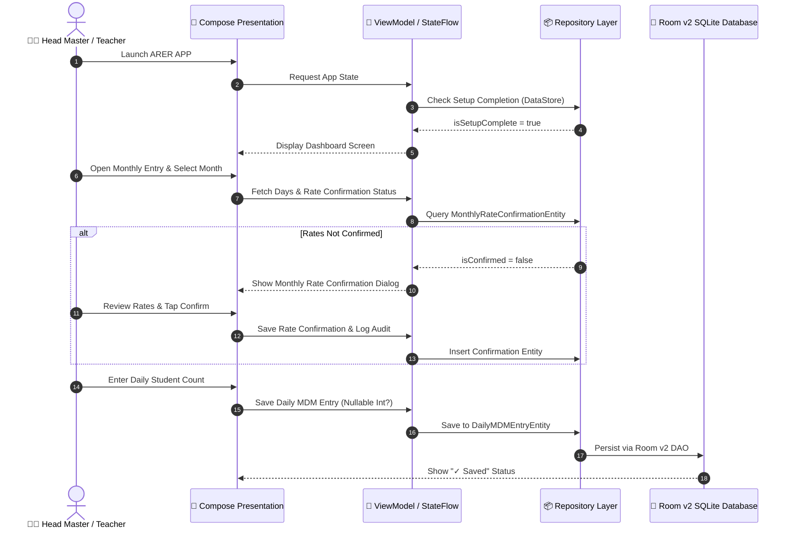
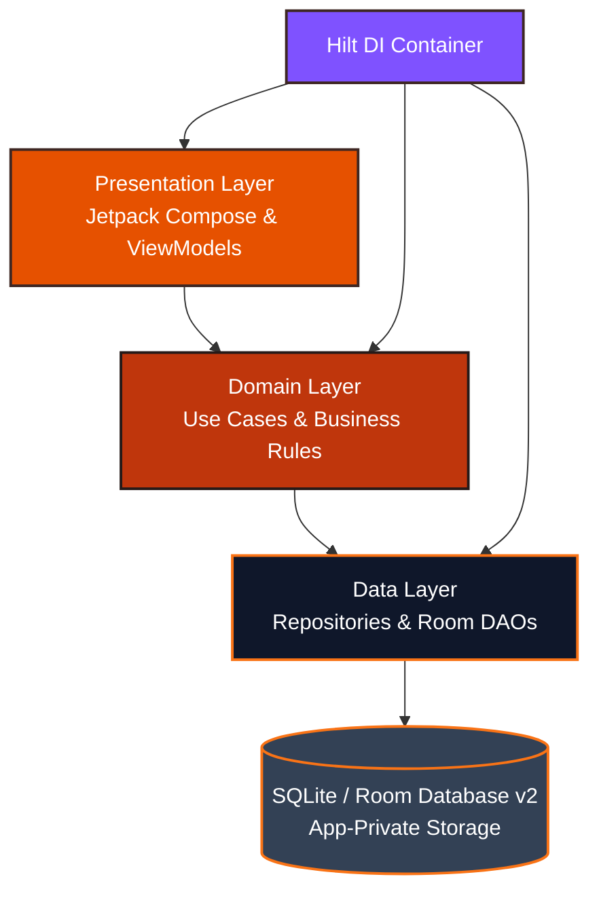

<div align="center">

# 🟠 ARER APP

### Simplifying Monthly MDM Reporting for Schools

A privacy-focused, offline-first Android application designed to make daily student-count entry, MDM rate management, monthly rate confirmations, and formal report generation simpler for Government and general schools.

<p align="center">
  
</p>

<p align="center">
  
  
  
  
  
  
</p>

`Current Version: V1 — Offline Android` &nbsp;|&nbsp; `Current Milestone: Phase 4 Complete`

</div>

<hr>

## 📑 Quick Navigation

- [Overview](#-overview)
- [Development Status](#-development-status)
- [The Problem vs. Solution](#-the-problem-vs--solution)
- [Design Philosophy](#-design-philosophy)
- [Current Features](#-current-features)
- [System Workflow](#-system-workflow)
- [Architecture & Clean Design](#-architecture--clean-design)
- [Database & Offline-First Architecture](#-database--offline-first-architecture)
- [Privacy & Security](#-privacy--security)
- [Tech Stack](#-tech-stack)
- [Project Structure](#-project-structure)
- [Testing & Quality Assurance](#-testing--quality-assurance)
- [Development Roadmap](#-development-roadmap)
- [Getting Started](#-getting-started)
- [License & Contributions](#-license--contributions)

<hr>

## 📖 Overview

School Head Masters (HMs) and Assistant Teachers traditionally maintain daily student attendance in registers or Excel spreadsheets, followed by manual monthly calculations of item-wise expenditures for Mid-Day Meal (MDM) bills. This manual workflow is prone to calculation errors, rate mismatches, and tedious paperwork.

**ARER APP** digitizes and streamlines this exact workflow into a lightning-fast, offline-first Android application designed specifically for Indian government and general schools.

---

## 🟠 Development Status

| Phase | Milestone | Status | Description |
| :---: | :--- | :---: | :--- |
| **Phase 1** | Architecture + Offline Database Foundation | ✅ **Completed** | Clean Architecture, MVVM, Room v2, Hilt DI, 10 Entities, DAOs. |
| **Phase 2** | School Setup + Local Profile + Auth | ✅ **Completed** | First-time onboarding, School/HM profile, default MDM item seeding, DataStore. |
| **Phase 3** | Daily MDM Entry + Working Day Engine | ✅ **Completed** | Month navigation, Sunday/holiday auto-detection, overrides, null vs zero distinction. |
| **Phase 4** | Rate Management + Monthly Rate Confirmation | ✅ **Completed** | Editable item rates, effective-date rate resolution, monthly rate review & confirmation. |
| **Phase 5** | MDM Calculation Engine (Paise Precision) | ⏳ **Next** | Exact minor-currency unit calculations and monthly totals. |
| **Phase 6** | Formal Report Exporter (PDF/CSV) | ⏳ **Planned** | Government-compliant monthly bill generation with Kannada Unicode. |
| **Phase 7** | History Archive & Analytics | ⏳ **Planned** | Archived report browser and contingency analysis. |
| **V2** | Cloud Sync & Stock Management | 🔮 **Future** | Encrypted cloud backups and multi-device synchronization. |

---

## 🛑 The Problem vs. 🚀 Solution

<table width="100%">
<tr>
<td width="50%" valign="top">

### 🔴 Traditional Manual Process
* **Paper Registers**: Daily attendance recorded across handwritten registers.
* **Manual Arithmetic**: Monthly item totals and fractional quantities computed manually.
* **Error Prone**: Off-by-one paise discrepancies lead to audit rejections and delayed grants.
* **Rate Drift**: Mid-year rate changes often corrupt past bill records.
* **Clerical Fatigue**: Hours of repetitive paperwork every month.

</td>
<td width="50%" valign="top">

### 🟢 ARER APP Solution
* **5-Second Daily Entry**: Single aggregate student count entered daily.
* **Smart Calendar Engine**: Automatically recognizes Sundays and government holidays; supports emergency overrides.
* **Paise-Exact Precision**: Integer arithmetic (`Long paise`) eliminates floating-point rounding bugs.
* **Historical Rate Snapshots**: Past bills are locked to the rates confirmed for that specific month.
* **Instant Export**: Ready-form audit reports without manual calculation.

</td>
</tr>
</table>

---

## 🎯 Design Philosophy

ARER is intentionally engineered around **"Simple enough for a first-time user."**

* **Minimal Screens**: No complex menus or deep navigation hierarchies.
* **Large Touch Targets**: Button sizes ($\ge 56\,\text{dp}$) optimized for everyday use.
* **Clear Status Indicators**: Immediate visual feedback (`✓ Saved`, `Missing Entry`, `Locked`).
* **Orange Visual Identity**: Professional, high-contrast, government-office appropriate palette (`#F97316`).
* **Bilingual Support**: Native English and Kannada (`ಕನ್ನಡ`) localization.
* **Offline-First**: Zero reliance on internet connectivity.

---

## ✨ Current Features

### 🏫 School & HM Setup
* Full school profile capture (Name, Code, UDISE, KGID, District, Taluk, Cluster, Address, PIN Code).
* Head Master profile management with persistent onboarding flags.

### 📅 Daily MDM Entry
* Month navigation selector (`<` Month `>`).
* Date-wise student count entry with safe auto-save.
* Strict distinction between **Missing Entry (`null`)** and **Explicit Zero (`0`)**.

### 🗓 Working Day Engine
* Automatic Sunday and local government holiday detection.
* Controlled emergency working-day overrides with reason logging and audit trail.

### 💰 Rate Management & Confirmation
* Manage item-wise MDM rates across the 11 default seeded items (`Vegetables`, `Sambar Items`, `Salt`, `Sugar`, `Dal`, `Oil`, `Gas`, `Egg`, `Milk`, `Girini`, `Banana`).
* Effective-date rate resolution ensuring historical rate preservation.
* Monthly Rate Confirmation workflow ensuring rates are reviewed and locked before reporting.

### 🗄 Offline Storage & Security
* Room database v2 with safe non-destructive migration (`MIGRATION_1_2`).
* 100% offline application-private storage with zero internet permissions requested.

---

## 🔄 System Workflow



---

## 🏛 Architecture & Clean Design

ARER APP follows strict **Clean Architecture** and **MVVM** principles:



---

## 🗄 Database & Offline-First Architecture

The Room v2 database manages 10 core entities with non-destructive migrations (`MIGRATION_1_2`):

* `SchoolProfileEntity`
* `HMProfileEntity`
* `MDMItemEntity`
* `ItemRateEntity` (Effective-date rate history)
* `HolidayEntity` (Local holiday calendar)
* `DailyMDMEntryEntity` (Nullable `studentCount` for missing vs zero distinction)
* `MonthlyRateConfirmationEntity` (Monthly rate lock)
* `MonthlyReportEntity`
* `MonthlyReportItemEntity` (Historical snapshots)
* `AuditLogEntity` (Action tracing)

---

## 🔐 Privacy & Security

* **100% Offline**: Zero network calls or external cloud dependencies in V1 core workflows.
* **App-Private Storage**: Databases and preferences are securely sandboxed inside internal app storage.
* **No Plaintext Secrets**: Authentication is abstracted via `AuthRepository`.
* **Audit Logging**: Important administrative rate changes and overrides are recorded locally via `AuditLogEntity`.

---

## 🛠 Tech Stack

| Technology | Purpose |
| :--- | :--- |
| **Kotlin 2.0.21** | Application programming language |
| **Jetpack Compose** | Declarative UI framework |
| **Material 3** | Design system & theming (Light/Dark/System) |
| **Room v2 (2.8.5)** | Local SQLite database with migration safety |
| **Dagger Hilt (2.60.1)** | Compile-time dependency injection |
| **Kotlin Coroutines** | Asynchronous operations & background threading |
| **StateFlow** | Reactive UI state propagation |
| **Navigation Compose** | Type-safe composable screen routing |
| **DataStore Preferences** | Local session and onboarding state persistence |
| **Android SDK** | Min SDK 26, Target SDK 37, Compile SDK 37 |

---

## 📂 Project Structure

```text
app/src/main/java/com/arer/app/
├── data/
│   ├── local/
│   │   ├── ArerDatabase.kt (v2 + MIGRATION_1_2)
│   │   ├── converter/
│   │   ├── dao/          # SchoolDao, MdmDao, HolidayDao, ReportDao
│   │   └── entity/       # 10 Room Entities
│   └── preferences/      # AppPreferences.kt (DataStore)
├── domain/
│   ├── model/            # Money.kt, Enums.kt
│   ├── repository/       # Repository Interfaces
│   └── usecase/          # Business Use Cases (ResolveRateForDate, etc.)
├── data/repository/      # MdmRepositoryImpl, SchoolRepositoryImpl
├── di/                   # Hilt Modules (DatabaseModule, AuthModule)
└── ui/
    ├── auth/             # LoginScreen, LoginViewModel
    ├── dashboard/        # DashboardScreen, DashboardViewModel
    ├── entry/            # MonthlyEntryScreen, MonthlyEntryViewModel
    ├── rates/            # RateManagementScreen, RateManagementViewModel, Dialogs
    ├── history/          # HistoryScreen
    ├── reports/          # ReportsScreen
    ├── settings/         # SettingsScreen, SettingsViewModel
    ├── setup/            # SchoolSetup, HmSetup, MdmSetup
    ├── splash/           # SplashScreen, SplashViewModel
    ├── navigation/       # ArerNavGraph.kt, Screen.kt
    └── theme/            # Color.kt, Theme.kt, Type.kt
```

---

## 🧪 Testing & Quality Assurance

The test suite validates money arithmetic, date calculations, and Room migration safety:

```bash
# Execute local JVM unit tests
./gradlew test
```

* **Unit Tests**: 15 tests passed successfully (`MoneyTest`, `DateUtilsTest`, `MdmDomainTest`, `RateResolutionTest`, `SetupValidationTest`).
* **Build Verification**: `./gradlew assembleDebug` builds successfully without warnings.

---

## 🗺 Development Roadmap

### Completed
* **Phase 1**: Architecture & Database Foundation
* **Phase 2**: School Setup + Auth + MDM Item Seeding
* **Phase 3**: Daily MDM Entry + Working Day Engine
* **Phase 4**: Rate Management + Monthly Rate Confirmation

### Next
* **Phase 5**: MDM Calculation Engine (Paise Precision)

### Planned (V1 Finalization)
* **Phase 6**: Formal PDF & CSV Report Exporter
* **Phase 7**: History Archive & Analytics

### V2 Vision
* Encrypted Cloud Backup & Multi-School Synchronization

---

## 🚀 Getting Started

### Prerequisites
* Android Studio (Koala / Ladybug or newer)
* JDK 17
* Android SDK (Min 26, Target 37)

### Clone & Build
```bash
git clone https://github.com/YOUR_GITHUB_USERNAME/ARER-APP.git
cd ARER-APP

# Build debug APK
./gradlew assembleDebug

# Run test suite
./gradlew test
```

---

## 📌 Project Status

ARER APP is currently under active development.  
**Current Milestone**: Phase 4 Complete & Verified.  
**Next Milestone**: Phase 5 — MDM Calculation Engine.

---

## 📜 License & Contributions

License: **Not yet specified.**  
Contributions, feedback, and architectural suggestions are welcome via Pull Requests.
